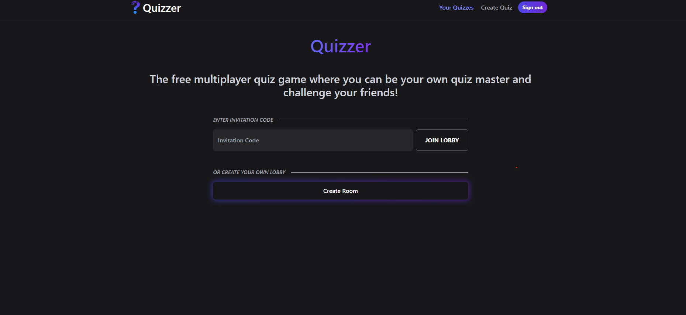
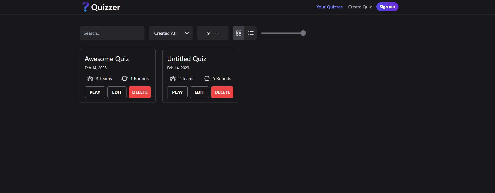
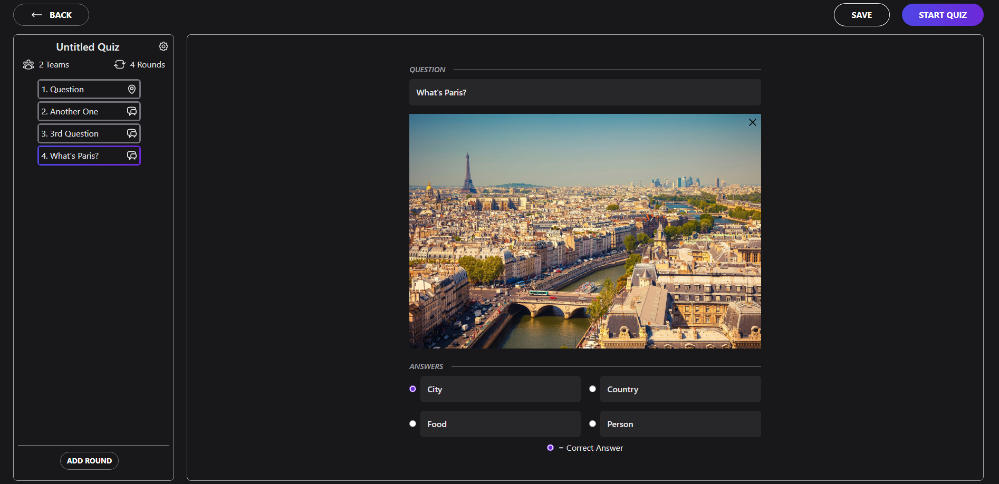

# Quizzer

## What is Quizzer?

Quizzer is a work in progress web app designed for people that always wanted to host their own quiz show and test their friends knowledge. Every other website i found that has a similar intention either doesn't allow for multiplayer, requires a degree just to understand how to create a quiz, or has very limited options for your questions. So i decided to try it out myself and focus on making the experience in creating a new quiz as easy as possible and making it fun. It is my first full stack app with the intention to challenge me and learn new technology that i never worked with before. I am no ui/ux designer so most of the design was heavily inspired by different websites that i like and will probably change once i have a vision of how i want the look of the site to be.

You can try a live demo [here](https://quizzer-eight.vercel.app/).

## Technologies used

Quizzer was created using the [t3-stack](https://create.t3.gg/) and other libraries that i found interesting and wanted to test out. I used [dnd-kit](https://dndkit.com/) to add a drag and drop functionality to let the user sort the questions of a quiz in an easy way. I also used some [radix ui](https://www.radix-ui.com/) components like the dialog and selection and styled them using [Tailwind CSS](https://tailwindcss.com/). I picked [zustand](https://github.com/pmndrs/zustand) as my state management tool because i already have some experience using contexts and redux and wanted to test new tools. 

The site is hosted using [Vercel](https://vercel.com/) and uses [Planetscale](https://planetscale.com/) as the database provider. 

## Currently implemented

- Authentication using google
- Creating/editing quizzes with 2 types of questions
- Viewing all your created quizzes with different sorting options

## What's coming next?

Things i want to implement before i think the mvp is ready:

- Finishing the quizzes view page (adding pagination, list view)
- Creating a nodejs server with socket.io for the multiplayer part
- Changing the database model to be more expandable in the future
- Quality of life improvements like tooltips and descriptions
- Fixing current bugs

Features planned after the mvp:

- Adding music integration
- Add mobile view
- Adding webcam support and/or customizable characters
- More question categories

## Screenshots

